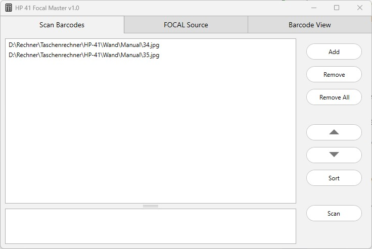
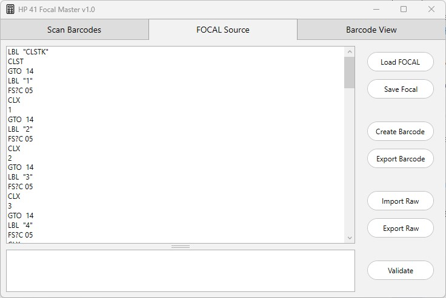
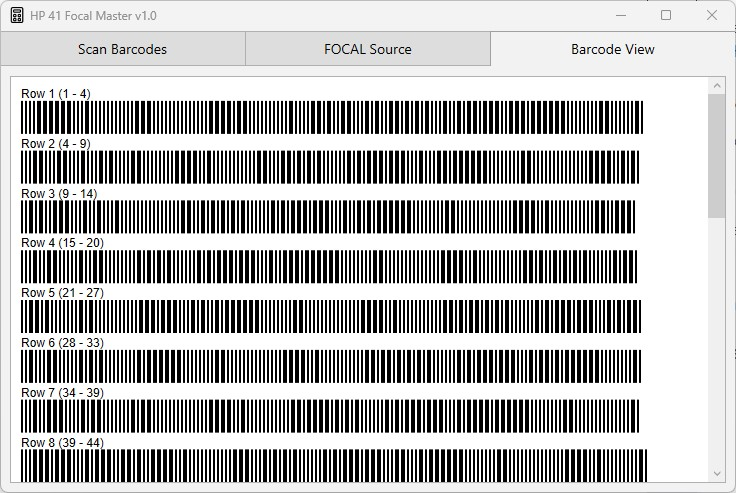
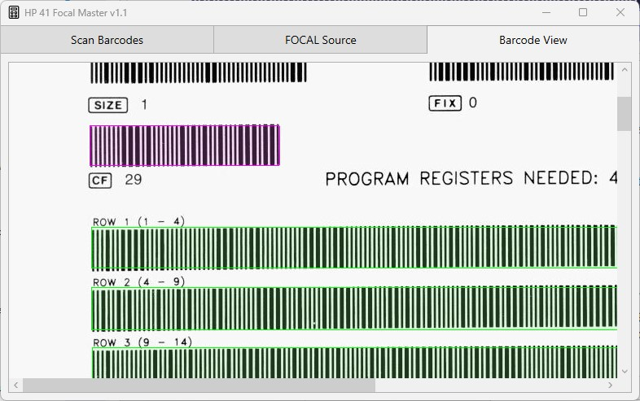

# Focal Master
FOCAL means "Forty One Calculator Language" and is the programming language of the famous HP 41 calculator. The FocalMaster lets you
- scan barcode files and convert them to a readable FOCAL program
- create barcodes as PDF or JPF files or for display on the screen
- edit the FOCAL program
- import a raw file and convert it to a readable FOCAL program
- export the FOCAL program to a raw file (used by simulators)

The FocalMaster is divided into 3 pages, the workflow goes from the left page to the right page. Throughout the following description the "RPN Primer" from the Wand manual (page 34 and 35) is used as an example.

### Scan Barcodes


Here you specify all image files that belong a one program and start the scan process. The order of the files is very important. The fist page of the barcode listing must be the first file in the list and so on. Otherwise the scanner stops with a checksum error.

#### Add
Add files to the list. Drag & Drop is also supported. Please note, that Drag & Drop does not keep the order of your selection.
#### Remove
Remove the selected file from the list.
#### RemoveAll
Clear the file list.
#### Up
Move the selected file one line up.
#### Down
Move the selected file one line down.
#### Sort
Sort all file alphabetically.
#### Scan
Start the scan process. If the scan was successful FocalMaster will jump to the "FOCAL Source" page and display the decoded FOCAL program. Otherwise the errors are displayed in error window.

### Focal Source

#### Load FOCAL
Load a FOCAL program from a file.
#### Save FOCAL
Save a FOCAL program to a file.
#### Create Barcode
Create the barcodes of the FOCAL program and display it on the "Barcode View" page. 
#### Export Barcode
Export the FOCAL program to a PDF file or JPG file(s). The PDF file contains all pages,  the page number is appende to initial JPG filename.
#### Import Raw
Import a raw file and decode the FOCAL program.
#### Export Raw
Export the FOCAL to a raw file. Raw files are used by HP 41 simulators to load programs.
#### Validate
Validate the FOCAL program. The result is shown in the error window.

The FOCAL compiler adds some syntax sugar like defining constants. The [manual](Manual.pdf) lists all details about the compiler and the recognized directives, XRom codes and statements. Example:
```
define MyVariable 01
define FirstLoopLabel 2
define LoopCounter 100
define ReadyMsg “READY”
define NowMsg “ NOW”

LBL “START”  ;the program starts here
LoopCounter
STO MyVariable
LBL FirstLoopLabel
DSE MyVariable
GTO FirstLoopLabel
ReadyMsg
>NowMsg        ;append
AVIEW
RTN
```


### Barcode View


The "Barcode View" displays the full FOCAL program as barcodes. It still needs to be tested whether the Wand can directly read barcodes from the screen.

### Debug Feature
In case the FocalMaster cannot successfully read a barcode image file, the hidden debug feature might help you to identify and fix the problem:
- the debug features works only on the first file of the list, move the problematic file to the top of the list
- click "Scan" while holding the CTRL key on the keyboard

FocalMaster will jump the the "Barcode View" page and display the image in gray scale. Additionally all identified barcodes are marked with a red rectangle. As shown below the command "CF 29" is recognized as a barcode. Usually the FocalMaster is able to ignore none-program barcodes. But there might be cases where such barcodes are tried to read as program barcodes - which does not succeed. It can help to create a new image out of existing one but remove the identified none-program barcodes and try again.



### Acknoledgment
The FocalMaster uses the PdfSharp library from Stefan Lange, empira Software GmbH.
