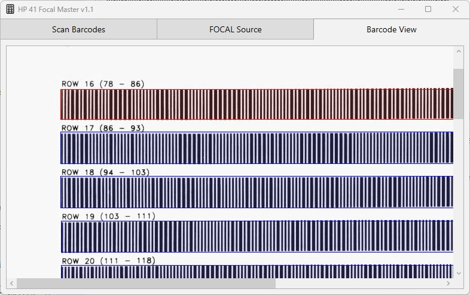
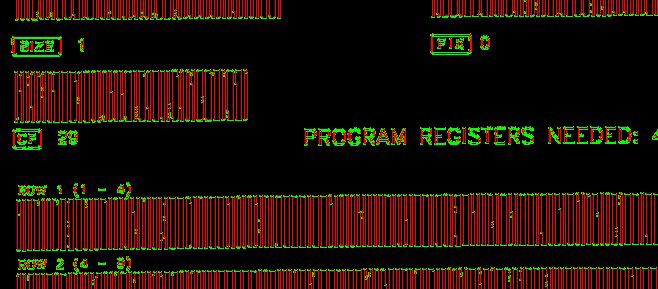
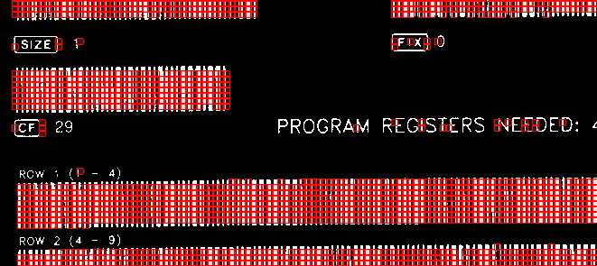
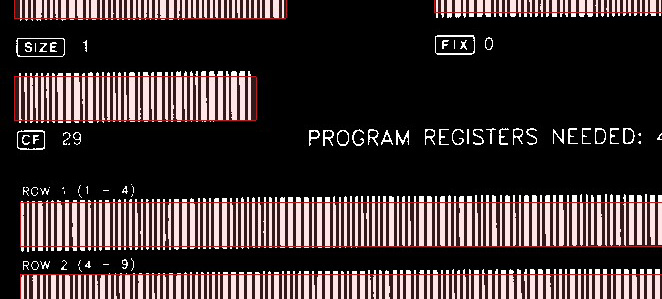

# Focal Master
The FocalMaster lets you
- scan barcode files and convert them to a readable HP-41 FOCAL program, supported input file formats are:
  - PDF
  - JPG
  - PNG
  - TIF
- export barcodes in the following file formats:
  - PDF
  - JPG
  - PNG
  - TIF
  - EMF (Enhanced Metafile)
  - SVG
- display barcodes on the screen
- edit the FOCAL program
- import a raw file and convert it to a readable FOCAL program
- export the FOCAL program to a raw file (used by simulators)

The FocalMaster is divided into 3 pages, the workflow goes from the left page to the right page. Throughout the following description the "RPN Primer" from the Wand manual (page 34 and 35) is used as an example.

### Scan Barcodes


Here you specify all image files that belong to one program and start the scan process. The order of the files is important. The first page of the barcode listing must be the first file in the list and so on. Otherwise the scanner stops with a checksum error.

#### Add
Add files to the list. Drag & Drop is also supported. Please note, that Drag & Drop does not keep the order of your selection.
#### Remove
Remove the selected file from the list.
#### RemoveAll
Clear the file list.
#### Up
Move the selected file one line up.
#### Down
Move the selected file one line down.
#### Sort
Sort all files alphabetically.
#### Scan
Start the scan process. If the scan was successful FocalMaster will jump to the "FOCAL Source" page and display the decoded FOCAL program. Informations, warnings and errors are displayed in error window.

### Focal Source

#### Load FOCAL
Load a FOCAL program from a file.
#### Save FOCAL
Save a FOCAL program to a file.
#### Create Barcode
Create the barcodes of the FOCAL program and display it on the "Barcode View" page. 
#### Export Barcode
Export the FOCAL program to a PDF file or JPG file(s). The PDF file contains all pages,  the page number is appende to initial JPG filename.
#### Import Raw
Import a raw file and decode the FOCAL program.
#### Export Raw
Export the FOCAL to a raw file. Raw files are used by HP 41 simulators to load programs.
#### Validate
Validate the FOCAL program. The result is shown in the error window.

The FOCAL compiler adds some syntax sugar like defining constants. The [manual](Manual.pdf) lists all details about the compiler and the recognized directives, XRom codes and statements. Example:
```
define MyVariable 01
define FirstLoopLabel 2
define LoopCounter 100
define ReadyMsg “READY”
define NowMsg “ NOW”

LBL “START”  ;the program starts here
LoopCounter
STO MyVariable
LBL FirstLoopLabel
DSE MyVariable
GTO FirstLoopLabel
ReadyMsg
>NowMsg        ;append
AVIEW
RTN
```


### Barcode View

The "Barcode View" displays the full FOCAL program as barcodes. It still needs to be tested whether the Wand can directly read barcodes from the screen.


### Special Characters
In almost all cases the HP-41 character codes correspond to the ASCII character code. But there are a few exceptions. Some of them cannot be entered on the PC keyboard. For 3 of these characters the HP document "Creating Your Own HP-41 Bar Code", page 17 proposes the following replacement:

| HP-41 Character | ASCII replacement |
|-----------------|-------------------|
| ∑ | & |
|  | @ |
| ≠ | # |

More character replacements are described in the manual.

### Scanning PDF Files
There are several ways a barcode can be included in a PDF file. The barcode scanner supports some of them:
- barcodes constructed with native PDF vector graphics (the way FocalMaster creates PDF files)
- embedded images like .jpg, .png, .png, in general the images need to be created with the RGB color space

The scanner does not support barcodes created with a special symbol font (that includes narrow and wide bars).
A page should either contain embedded images or native vector graphics. If a page contains both the native vector graphics are ignored.

### Known limitations
The barcodes on one page should have the same size while barcodes on different pages can have different sizes.

### Debug Feature
In case you are interested in the detailed evaluation of all barcodes on all pages, use the debug feature:
- click "Scan" while pressing down the CTRL key on the keyboard

FocalMaster analyzes all images, the process does not stop at the first occurence of an error. When finished FocalMaster jumps to the "Barcode View" page and displays all images (in gray scale) and all barcodes are marked with a color code.

- **green**: successfully scanned barcode
- **red**: checksum error
- **magenta**: no program barcode, is ignored
- **cyan**: potential barcode detected but ignored after final evaluation
- **blue**: potential barcode detected but not yet evaluated (the first checksum error aborts the evaluation of all following potential barcodes)




As shown below the command "CF 29" is recognized as a barcode but ignored because its not a program barcode. Usually the FocalMaster is able to ignore none-program barcodes. But there might be cases where such barcodes are wrongly tried to read as program barcodes - without success. It can help to create a new image out of existing one but remove the identified none-program barcodes and try again.


### Acknowledgment
The FocalMaster uses 
- the PdfSharp library from Stefan Lange, empira Software GmbH.
- the PdfSharp.Extensions from gheeres

### The Barcode Finding Algorithm
The following steps are processed in order to find barcodes in an image:

- Convert the image to a gray scale image.
- Convert the gray scale image to a "binary" image that contains only pure black and pure white pixels. All following steps work on this binary image.
- Apply an edge detection filter to get the 1st derivative of each pixel.
- Mark each pixel either vertical (red) or horizontal (green) or none (black).


- Split the edge detection result image into square boxes, starting point is 5x5 pixels.
- For each box determine whether the box contains more vertical slopes than horizontal slopes. If so add the box to the list of potential barcode boxes.


- Combine found boxes that are next to each other to potential barcode areas.
- Ignore areas that are obviously too small.


- Try to decode the areas according to the HP-41 barcode definition.
- If no barcode is found repeat the steps with a bigger box size up to 20x20 pixels.
